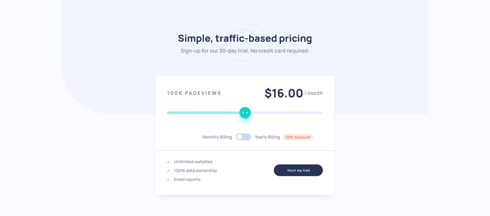

# Frontend Mentor - Interactive pricing component solution

This is a solution to the [Interactive pricing component challenge on Frontend Mentor](https://www.frontendmentor.io/challenges/interactive-pricing-component-t0m8PIyY8). Frontend Mentor challenges help you improve your coding skills by building realistic projects.

## Table of contents

- [Overview](#overview)
  - [The challenge](#the-challenge)
  - [Screenshot](#screenshot)
  - [Links](#links)
- [My process](#my-process)
  - [Built with](#built-with)
  - [What I learned](#what-i-learned)

**Note: Delete this note and update the table of contents based on what sections you keep.**

## Overview

### The challenge

Users should be able to:

- View the optimal layout for the app depending on their device's screen size
- See hover states for all interactive elements on the page
- Use the slider and toggle to see prices for different page view numbers

### Screenshot



### Links

- Solution URL: [Solution](https://github.com/agusthas/interactive-pricing-component)
- Live Site URL: [Github Pages](https://agusthas.github.io/FEM_interactive-pricing-component/)

## My process

### Built with

- Semantic HTML5 markup
- CSS custom properties
- Flexbox

### What I learned

Learned about converting currency in JavaScript!. I was thinking of doing it manually but come across Intl object in JavaScript!.

```javascript
  const price.textContent = new Intl.NumberFormat('en-US', {
    style: 'currency',
    currency: 'USD'
  }).format(
    toggle.checked
      ? pricesList[slider.value] * discount
      : pricesList[slider.value]
  );
```
